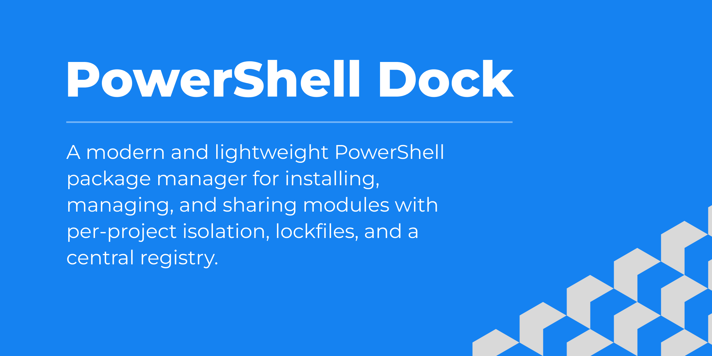

Dock is a lightweight package manager for PowerShell that simplifies installing, updating, and sharing modules.  
It provides per-project environments, lockfiles, and a central registry to ensure consistent and reliable dependency management.

This organization hosts the core Dock CLI along with related projects such as the official website, documentation, and community resources.  
Our goal is to provide developers with a modern, streamlined experience for managing PowerShell packages.

If you are new to Dock, start with the [main repository](https://github.com/powershell-dock/powershell-dock).  
For documentation and guides, visit the [website repository](https://github.com/powershell-dock/powershell-dock-website) or the published site.

We welcome contributions and discussions across all repositories. Please refer to the contribution guidelines in each project before submitting changes.
